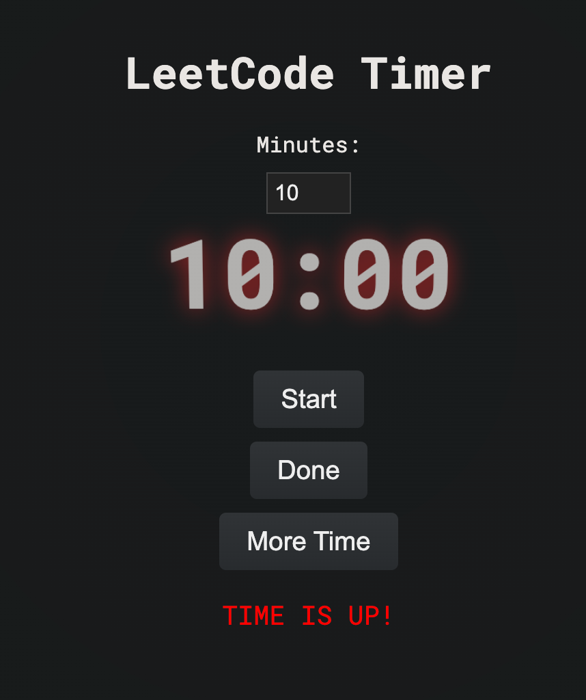
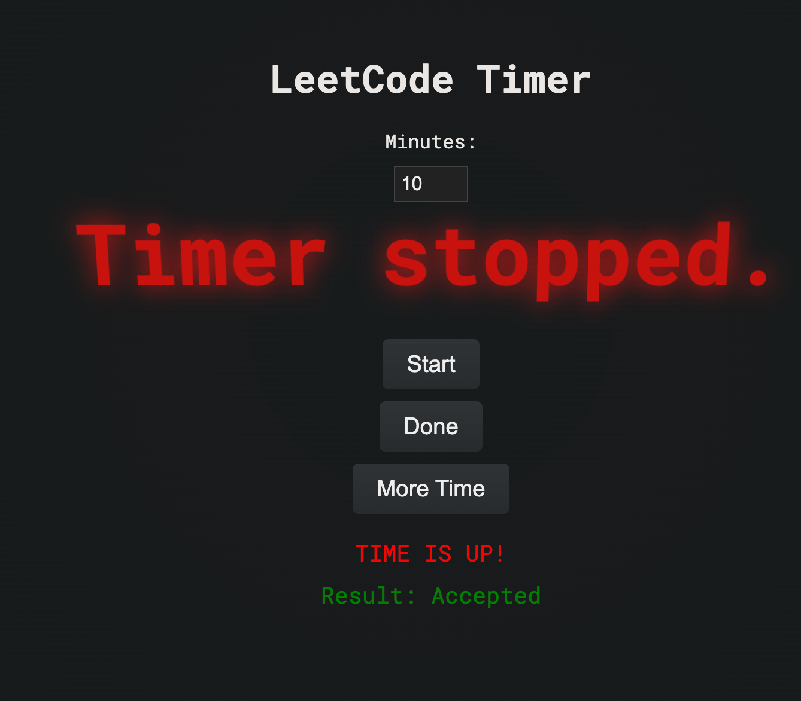

# Ominous Timer

# State of the Repository:

All of the timers are working. Each of the timers was created only by using the LLM with the name of the file. Deep Seek and Claude need human interation to point out the bugs, while Gemini and gpt made the correct submission right away. I'd say deepseeks looks best, but it could't win cause it didn't work initially. Thus, the final verdict:
1. Gemini ADvanced
    - The timer works out of the box, and it looks clean
2. GPT_O1
    - The timer works out of the box, and it has a nice design. No sound included, and requires user to click reset in order to make another timer.
3. Deep Seek
    - The best timer, although disqualified cause it didn't work initially. Has the best design, but also no sounds included.
4. Claude
    - The timer works, but looks very very poor. And it didnt work on the first run. I really though Claude would win.

# Initial task

All four LLMs received the same prompt. They were tasked with creating an ominous timer app and refining it over three steps:

## Prompt 1:

```markdown
Please write a simple webpage that acts as a
```

online timer (stopwatch) thats ominous and makes you feel under time pressure. I need something to set myself 10 / 15 minuts time to do leet code under time constraint
```

It can use any number of extra libraries, as long as the final page is contained within a single file. The winning project will be the one that leverages existing libraries effectively, creating a neat and simple solution without reinventing the wheel.

Think like a pro—you wouldn’t use vanilla JavaScript, but rather a few well-chosen libraries to achieve shockingly nice results with minimal code.
```

## Prompt 2:

```markdown
Hmm... this solution is nice, but the time MUST be adjustable, so that I can choose a custom timeslot if needed. An extra bonus point for two new buttons:

DONE a button that stops a timer when you did a task. It should show your result.

MORE TIME, a button which adds 5 minutes (but no more than 40% of the original time) and changes the clock to red.
```

## Prompt 3:

```markdown
Now you can refactor the code, and add any changes to wow the judge before sunmission.
```

*The typo in the prompt is intentional. It might influence weaker LLMs.*

---

# Winner

The state of all files (except gemini that I needed to patch, cause it referenced previous response blocks) is saved in commit **0cf1e81** if you wish to review them in the state that was judged. However, for the convenience of random internet visitors, here are images of each timer:

### Gemini Advanced Timer:



### Deepseek Timer:


### Claude Timer:


### The Winner: GPT_O1 Timer
#### Starting Page

#### First Counter Screen

#### What Happens When You Ask for More Time

#### What Happens When You Finish the Task


---

The final repository version contains the code where each model received specific feedback on what was not working, and they had a last chance to fix their mistakes. You can view these results simply by opening the HTML file.

