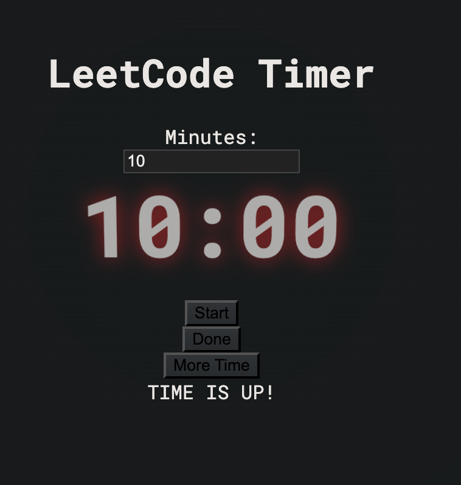
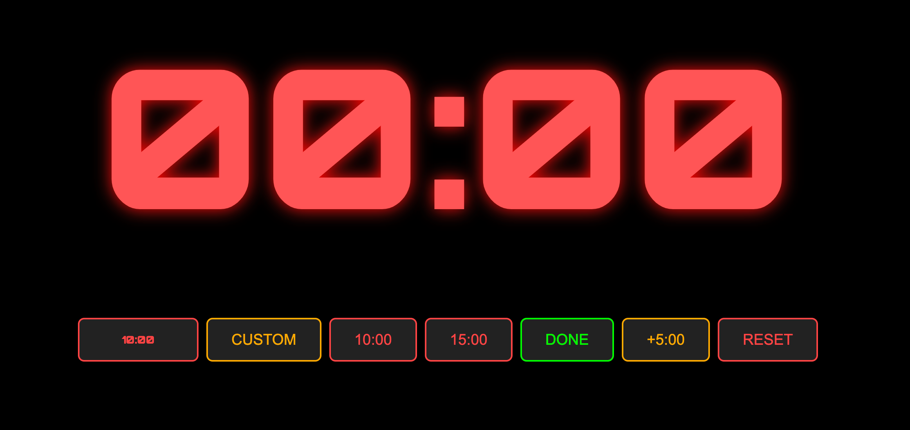
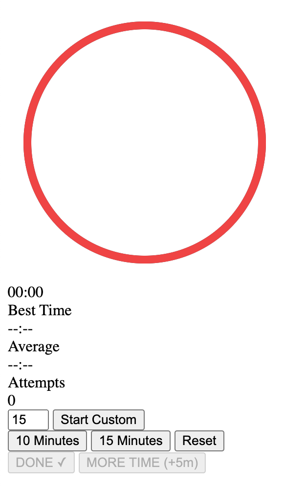
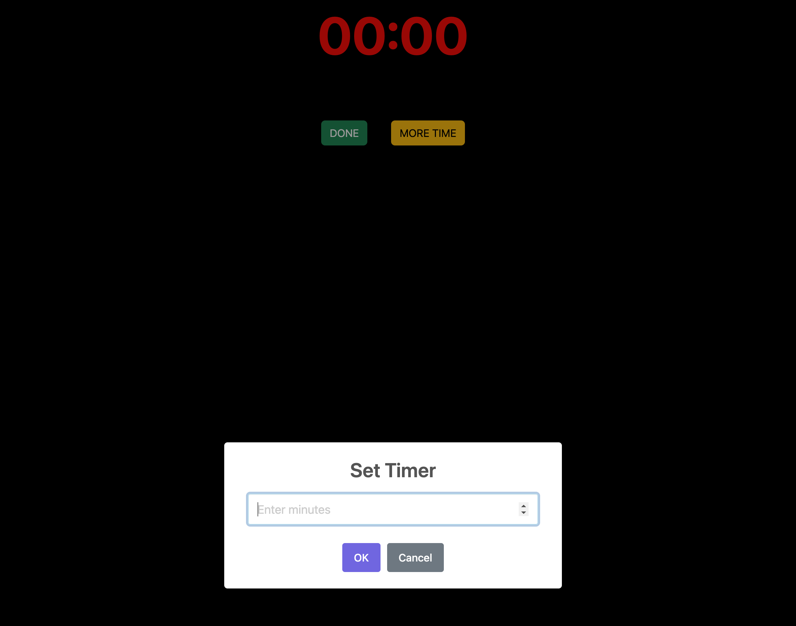
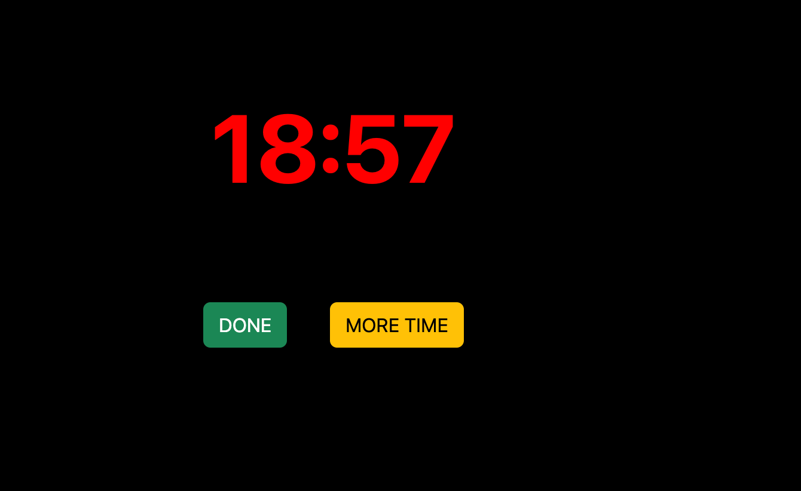
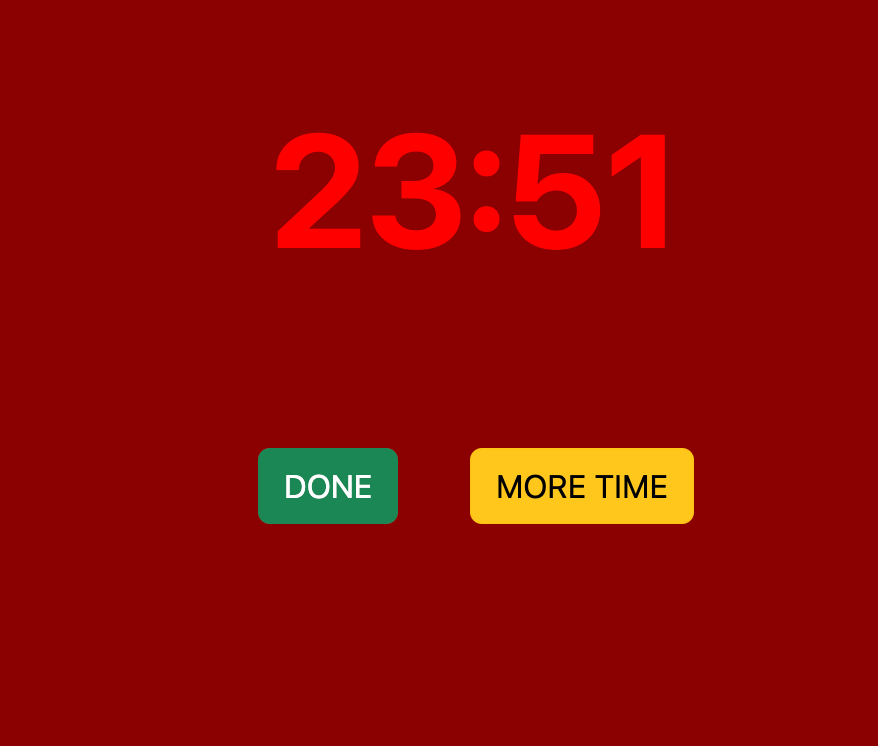
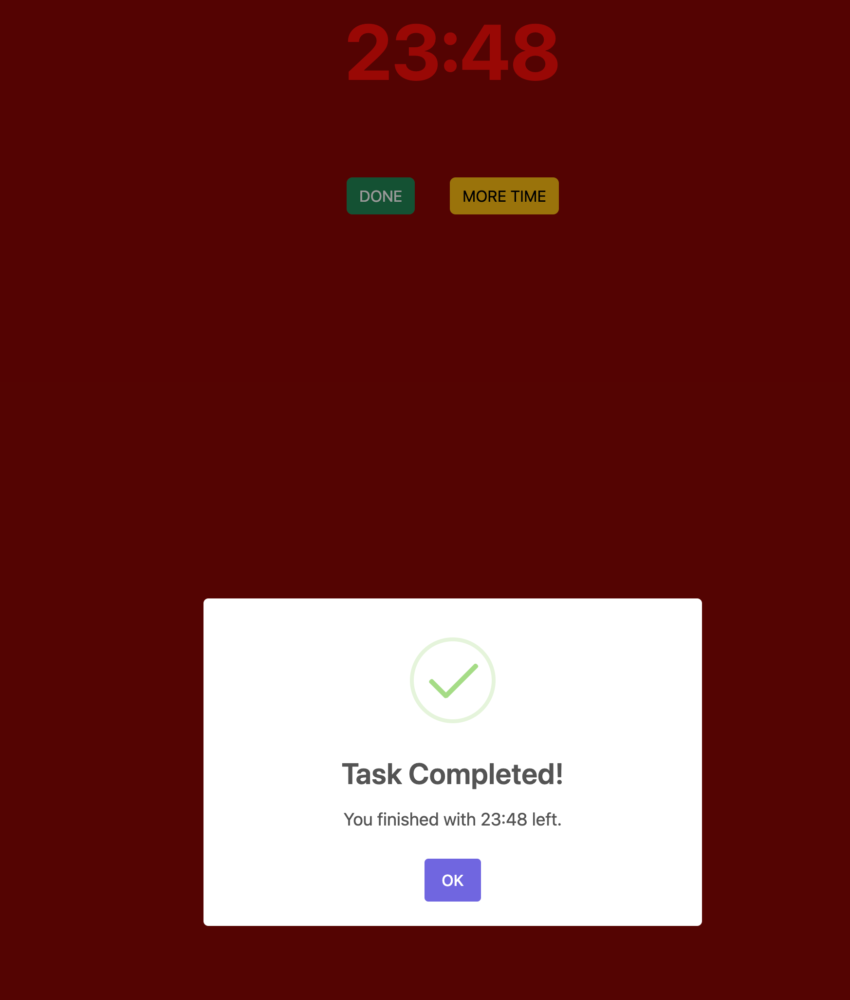

# Ominous timer

All four LLM's got the same prompt. They were asked to create an ominous timer app, and then refine it in three steps:

## Prompt 1:

```markdown
Please write a simple webpage that acts as a 
\`\`\`
online timer (stopwatch) thats ominous and makes you feel under time pressure. I need something to set myself 10 / 15 minuts time to do leet code under time constraint
\`\`\`
It can use any number of extra libraries, as long as the final page is written in one file only. The project that utilizes ready made libraries to make a neat and simple solution without spending time to write something that was already made will be a winner here. 

So think like a pro - you wont use vanilla js, but probably use few libs to get a shockingly nice (but simple in code) results with little code.
```

## Prompt 2:


```markdown
Hmm... this solution is nice, but the time MUST be adjustable, so that I can choose a custom timeslot if needed. An extra bonus point for two new buttons:

DONE a button that stops a timer when you did a task. It should show your result.

MORE TIME, a button which adds 5 minutes (but no more than 40% of the original time) and changes the clock to red.
```

## Prompt 3:

```markdown
Now you can refactor the code, and add any changes to wow the judge before sunmission.
```

* the mistake in prompt is intentional. It might influence weaker LLM's.


# Winner

Although I initially thought to ask LLM's to judge each other and let them choose who won, it was not needed. Turns out only the version from gpt_o1 model actually works as a timer. All other webpages, show a result but didnt work. The state of those files is saved in commit 0cf1e81 if you wish to see it, but for the pleasure of random internet walkers, here are the images of each timer:

# Gemini Advanced timer:



# Deepseek timer:



# Claude timer:



# The winner: gpt_o1 timer:

## Starting page

## First counter screen

## What happens when you ask for more time

## And what happens when you finish the task



Ths code that you see as a final repo verion is the one where each model got a custom description of things which were not working, and had a last chance to fix their mistakes. Those results you can view simply by opening the html file.

